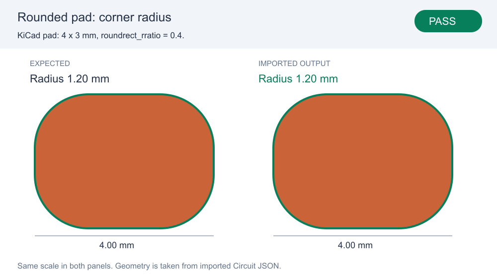
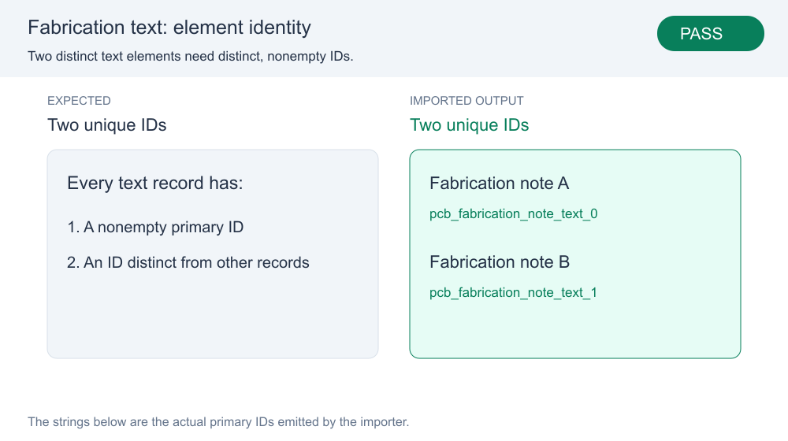
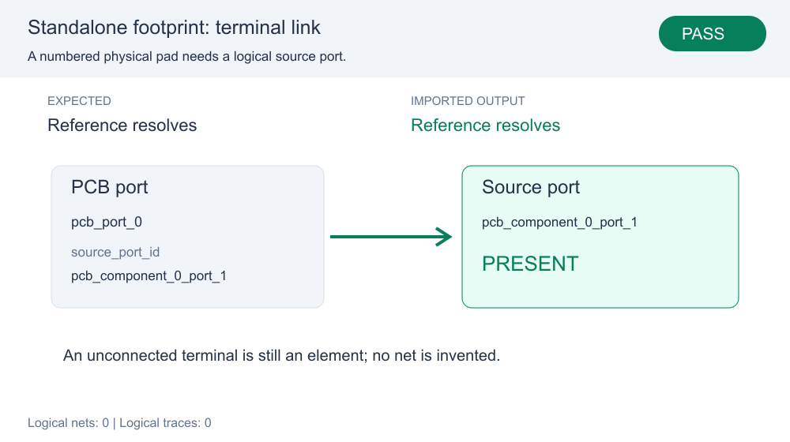
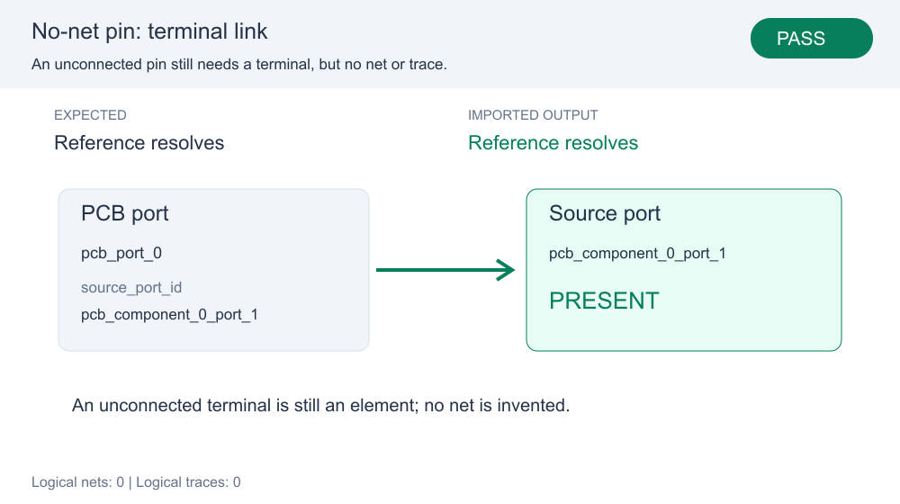
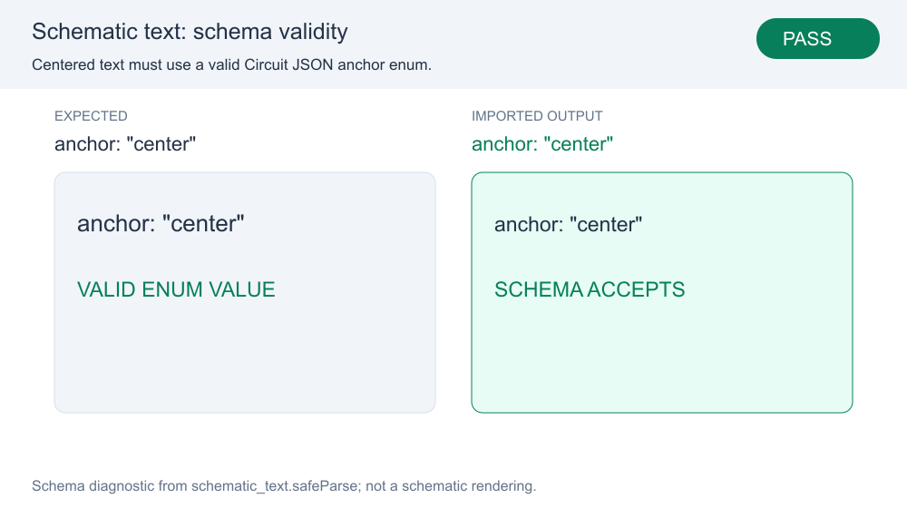

# KiCad import invariant repros — corrected snapshots

These snapshots assert five corrected importer invariants. The first stacked PR records the known-bad baseline; this layer fixes the importer and changes the same snapshot files from red DEFECT to green PASS. Each evidence entry is now required to pass, in addition to matching its SVG/JSON snapshot.

The three small KiCad inputs in `fixtures/` are shared by both stack layers. `evidence.ts` runs the real converters and reads the emitted values and references. `render-evidence.ts` turns that evidence into reviewable SVG/PNG cards. The roundrect card draws the actual imported geometry at the same scale as the KiCad specification. The other cards are explicitly data/schema diagnostics, not fabricated screenshots of the KiCad UI.

| Corrected behavior | Snapshot |
|---|---|
| Roundrect corner radius is 1.20 mm |  |
| Fabrication text receives distinct nonempty primary IDs |  |
| Standalone footprint source-port reference resolves |  |
| A no-net PCB pin has a valid source port and no net |  |
| Default schematic text uses the valid center anchor |  |

Run:

```sh
bun test tests/repros/fuzz-import-invariants/import-invariants.test.ts
```

Regenerate intentionally:

```sh
UPDATE_IMPORT_REPRO_SNAPSHOTS=1 bun test tests/repros/fuzz-import-invariants/import-invariants.test.ts
```

Tests compare exact generated SVG and JSON evidence. Committed PNG previews have dimension and integrity-hash checks; they are generated together with SVG/evidence on explicit updates. This avoids platform font rasterization differences becoming pixel-test failures. PNGs are reviewer artifacts, not independent pixel-diff oracles.
