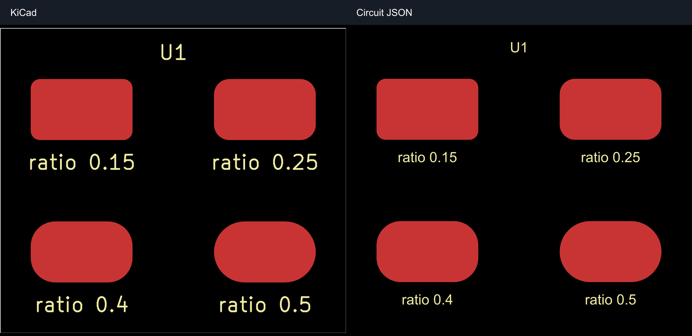
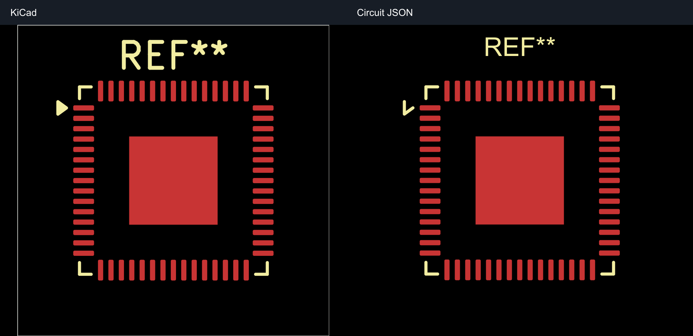

# KiCad imports: actual renderer comparisons

These images use **KiCad CLI SVG output on the left** and **`circuit-to-svg` rendering of the imported Circuit JSON on the right**. There is no hand-drawn replacement for circuit geometry. Only the engine-name header is added when composing the PNGs.

This fix layer uses identical fixtures and KiCad reference images from the baseline PR, updates the actual Circuit JSON renders, and asserts the corrected invariants.

## Rounded-pad fixture

The four 5 × 3 mm pads use KiCad radius ratios 0.15, 0.25, 0.4 and 0.5. The baseline importer halves their corner radii; the bottom-right pad should be a pill. This makes the geometry loss directly visible in both real renderers.



## Existing QFN-60 footprint

`fixtures/qfn60.kicad_pcb` wraps the repository's `tests/assets/QFN-60-1EP_7x7mm_P0.4mm_EP3.4x3.4mm.kicad_mod` in a minimal board. Geometry is retained; library-only version/generator metadata is removed, and board placement/identity and a bounding outline are added for plotting. This is a real footprint with 60 peripheral pins and an exposed pad.



Font shape/size and some silkscreen details differ between engines independently of the roundrect correction. These snapshots expose those differences; they do not claim full pixel parity.

## Reproduction and provenance

```sh
# Run the evidence and renderer regression tests using committed KiCad references.
bun test tests/repros/fuzz-import-invariants

# Generate both sides from the actual engines; requires kicad-cli.
UPDATE_IMPORT_REPRO_SNAPSHOTS=1 UPDATE_KICAD_REFERENCES=1 \
  bun test tests/repros/fuzz-import-invariants

# Update only the Circuit JSON output after an importer change.
UPDATE_IMPORT_REPRO_SNAPSHOTS=1 \
  bun test tests/repros/fuzz-import-invariants
```

Raw KiCad SVGs, raw Circuit JSON SVGs, individual PNGs, composed PNGs and full Circuit JSON are committed next to the comparison images. `*.provenance.json` records input hashes, KiCad/renderer versions and output hashes. The KiCad exports use `F.Cu,F.SilkS,Edge.Cuts`; the Circuit JSON renderer uses matching front-side visibility and the board's physical bounds. Rasterization and proportional resizing are done by Sharp on a black background. No copper paths are redrawn or corrected in the presentation code.

Tests compare the newly rendered Circuit JSON SVG and full imported JSON with the golden outputs, check fixture/reference provenance and validate image hashes. KiCad references are regenerated explicitly, because different KiCad versions can change plot serialization. The PNGs are real-render previews, not a cross-platform pixel-equivalence oracle.

The five ID/reference/schema/geometry evidence JSON files assert the corrected invariants in this fix layer. IDs and missing logical references are not reliably visible in a PCB render; their tests stay as data assertions instead of fabricated images.
