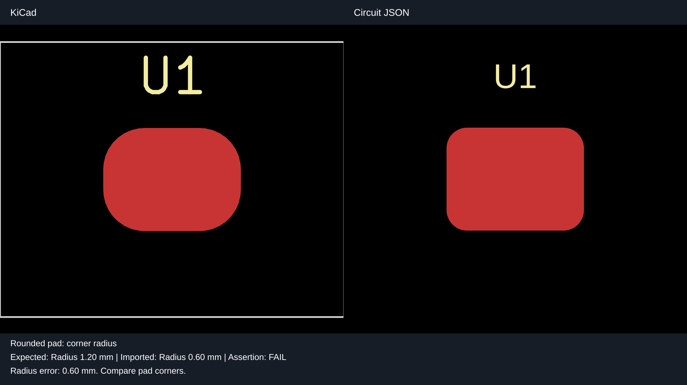
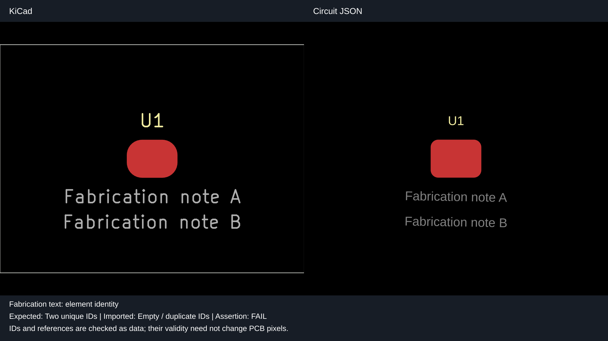
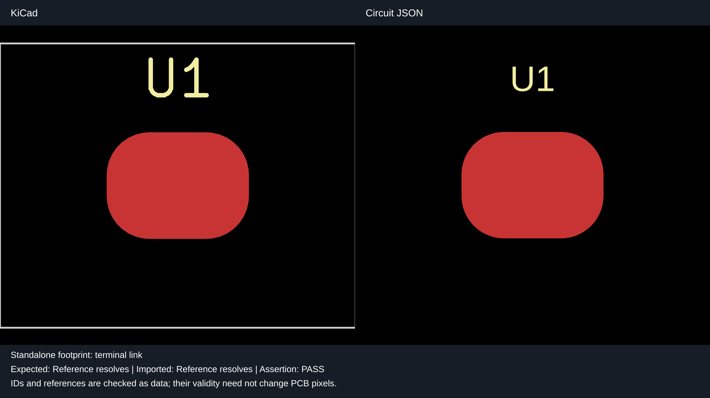
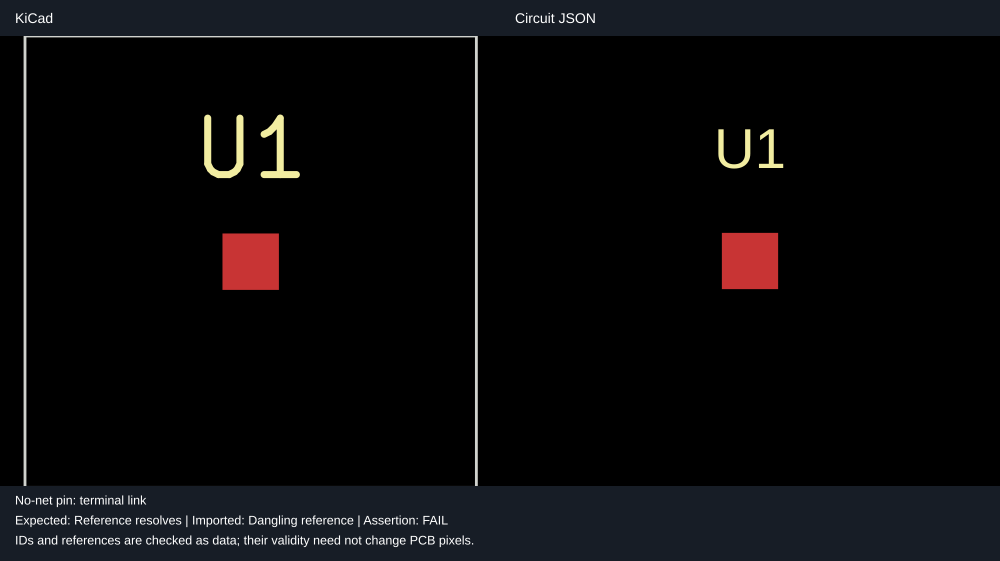
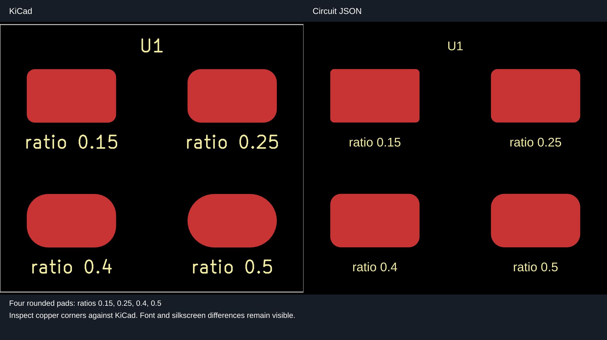
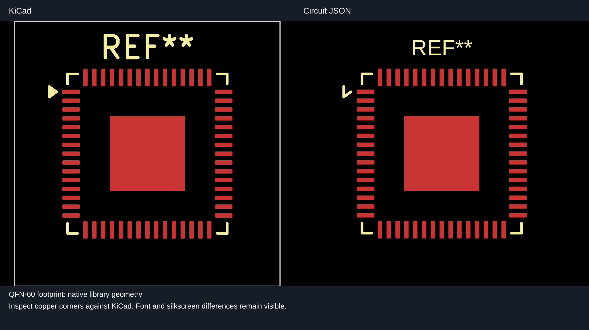

# KiCad imports: actual renderer comparisons

These images use **KiCad CLI SVG output on the left** and **`circuit-to-svg` rendering of the imported Circuit JSON on the right**. There is no hand-drawn replacement for circuit geometry. Engine-name headers and assertion captions are added outside the actual render panels. Every visual defect has a matching comparison SVG; a coverage test enforces SVG-only snapshots. The text-only schematic has an anchor assertion and no image snapshot.

This baseline records the importer before the fixes. The second stacked PR uses identical fixtures and KiCad reference images, updates the actual Circuit JSON renders, and asserts the corrected invariants.

## Rounded-pad radius

4 × 3 mm pad, ratio 0.4: expected radius 1.20 mm; baseline gives 0.60 mm (50% too small).



## Fabrication text IDs

Both fabrication labels are rendered with F.Fab enabled. The baseline assigns two empty IDs; the fix assigns two unique IDs. The ID defect itself does not change text geometry.



## Standalone terminal

The actual standalone footprint converter is used on the Circuit JSON side. The baseline physical pad points at a missing logical terminal. Fixing its reference does not itself change copper pixels; this shared fixture also exposes the radius defect.



## Unconnected terminal

A real no-net board pad still needs a logical terminal. The baseline reference is dangling; the corrected one resolves, with zero invented nets or traces. This data defect has no visible copper difference.



## Schematic text alignment

The baseline `center_center` anchor is invalid. The fixed `center` value passes the Circuit JSON schema assertion.

The text-only schematic is checked by an assertion in `import-invariants.test.ts`; its expected evidence is stored in `assets/schematic-text-anchor.json`.

## Rounded-pad fixture

The four 5 × 3 mm pads use KiCad radius ratios 0.15, 0.25, 0.4 and 0.5. The baseline importer halves their corner radii; the bottom-right pad should be a pill. This makes the geometry loss directly visible in both real renderers.



## Existing QFN-60 footprint

`fixtures/qfn60.kicad_pcb` wraps the repository's `tests/assets/QFN-60-1EP_7x7mm_P0.4mm_EP3.4x3.4mm.kicad_mod` in a minimal board. Geometry is retained; library-only version/generator metadata is removed, and board placement/identity and a bounding outline are added for plotting. This is a real footprint with 60 peripheral pins and an exposed pad.



Font shape/size and some silkscreen details differ between engines independently of the roundrect correction. These snapshots expose those differences; they do not claim full pixel parity.

## Reproduction and provenance

```sh
# Run the evidence and renderer regression tests using committed KiCad references.
bun test tests/repros/fuzz-import-invariants

# Generate both sides from the actual engines; requires kicad-cli.
UPDATE_IMPORT_REPRO_SNAPSHOTS=1 UPDATE_KICAD_REFERENCES=1 \
  bun test tests/repros/fuzz-import-invariants

# Update only the Circuit JSON output after an importer change.
UPDATE_IMPORT_REPRO_SNAPSHOTS=1 \
  bun test tests/repros/fuzz-import-invariants
```

Only paired comparison SVGs live in `__snapshots__/real-renders`. Circuit JSON, invariant evidence and provenance live in `assets/`. Native KiCad reference inputs live in `fixtures/kicad-reference`. Both engines’ original vector geometry is embedded in the paired SVG, with no raster images. `*.provenance.json` records input hashes, KiCad/renderer versions and output hashes. PCB exports use `F.Cu,F.SilkS,Edge.Cuts`, plus `F.Fab` for the fabrication case; the Circuit JSON renderer uses matching front-side visibility and the board's physical bounds. The paired SVG uses nested vector viewports at corresponding scales. Standalone footprints are wrapped in a temporary board for native export; the importer still receives the original .kicad_mod. Only a plotting outline and required board metadata are added. The no-net native export similarly adds a plotting outline. No copper paths are redrawn or corrected in the presentation code.

Tests compare the complete paired SVG with its snapshot, assert imported JSON against `assets/`, and check fixture/renderer provenance. KiCad references are regenerated explicitly, because different KiCad versions can change plot serialization. The SVGs are real-render previews, not a cross-platform pixel-equivalence oracle.

The five ID/reference/schema/geometry evidence JSON files remain characterization tests in this first stack layer. IDs and missing logical references are not reliably visible in a PCB render; their tests retain data assertions alongside real render comparisons, with explicit captions for nonvisual failures.
